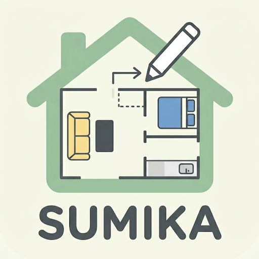

# SUMIKA（すみか）



ブラウザで動く間取り検討アプリです。部屋の配置・建具・家具・土地形状を2Dグリッド上で設計し、3Dウォークスルーで確認できます。

## 機能

- 部屋の配置・リサイズ・ラベル編集
- 壁・ドア・窓の配置（建具）
- 家具の配置（ソファ・ローテーブルを含む9種）
- 階段（1F/2F連携）
- 土地形状の描画（辺の長さ・建ぺい率・容積率表示付き）
- 採光オーバーレイ（2Dグリッド上にセル単位で表示）
- 採光シミュレーション（方位・時刻、3Dウォークスルー内）
- 3Dウォークスルー（Three.js）
- 部屋ごとの床材・壁色設定（7種の床材、任意の壁色）
- 右クリックコンテキストメニュー（複製・削除・回転・蝶番反転など）
- PDF・SVG・PNG出力
- 複数プロジェクトの管理（作成・切替・リネーム・複製・削除・ソート）
- データの保存・JSON入出力

## ローカルでの起動方法

このアプリは ES Modules（`import` / `export`）を使用しているため、**ローカルファイルを直接ブラウザで開くことはできません**。ローカルサーバーが必要です。

### Node.js を使う場合

```bash
# リポジトリをクローン
git clone <repository-url>
cd SUMIKA

# npx でサーバーを起動（インストール不要）
npx serve .
```

ブラウザで `http://localhost:3000` を開きます。

### Python を使う場合

```bash
cd SUMIKA
python3 -m http.server 8080
```

ブラウザで `http://localhost:8080` を開きます。

### VS Code を使う場合

[Live Server](https://marketplace.visualstudio.com/items?itemName=ritwickdey.LiveServer) 拡張をインストールし、`index.html` を右クリック →「Open with Live Server」を選択します。

## 技術スタック

- Vanilla JavaScript（ES Modules）
- SVG（壁・建具・土地レイヤー）
- [Three.js](https://threejs.org/) v0.165（3Dウォークスルー）
- HTML / CSS のみ（フレームワーク・ビルドツール不要）
